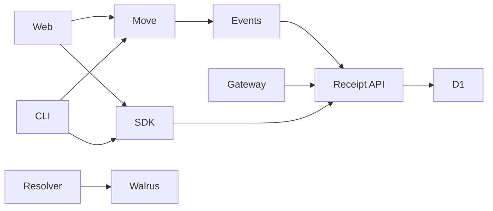

# OpenRails Component Inventory

Last updated: 2026-06-21

This document is an agent handoff map of the components that currently make up OpenRails. It is intended to help a new agent quickly find source-of-truth files, understand trust boundaries, run validation, and avoid unsafe staging or secret handling.

## Repository map

| Path | Role |
| --- | --- |
| `move/` | Sui Move protocol package and tests. |
| `sdk/` | TypeScript SDK, PTB builders, signatures, gateway, receipt parsing, proof client, nonce engine, product receipts, access credentials, CLI. |
| `services/receipt-api/` | Cloudflare Worker for receipts, streams, proofs, gateway collection, nonce reads, credential verification, D1 storage, scheduled indexing. |
| `services/resolver/` | Cloudflare Worker for resolving Walrus OpenRails envelopes. |
| `apps/web/` | V1.2 Console operator frontend. Wallet writes (dapp-kit + Enoki zkLogin), dense mono UI. Branch: `console-app`. |
| `examples/` | RailsCard, RailsFlow, gateway demo scripts. |
| `scripts/` | Testnet proof manifest, publish script, E2E guides. |
| `docs/` | Handoff and V1.2/V2 architecture blueprints. |
| `uiland/` | Untracked UI research/assets. Do not stage without explicit user approval. |

## System shape



## Trust boundaries

| Surface | Authority level | Notes |
| --- | --- | --- |
| Move package | authoritative onchain state | Owns channel lifecycle, asset movement, terminal settlement receipts. |
| `SettlementReceipt` event | authoritative terminal accounting | Source for receipt indexing and proof terminal state. |
| `NonceAccount` lanes | authoritative replay guard | `verify_and_consume` is atomic; stale value aborts entire tx. |
| `ChannelMetadataAnchored` event | authoritative metadata binding | Links `metadata_hash` to a `paycard_id` at mint time. |
| Gateway events | signed offchain projection | Useful for UX/webhooks, not final settlement authority. |
| `AccessCredentialV1` | payer-signed bearer | Verified off-chain by services; not a Move object. |
| Receipt API | aggregation/indexing layer | Reads Sui events and D1 projections. |
| Web console | operator write surface | Browser wallet writes + read-only dashboard. |
| SDK CLI | developer tool | Read and write SDK surface. |
| Resolver Worker | metadata/envelope fetch layer | Validates OpenRails envelope shape from Walrus aggregators. |

## Move protocol components

### `move/sources/paycard_v1.move`

Primary V1.x channel primitive. V1.2 adds `metadata_hash` and wires in `NonceAccount`.

Key object:

- `Paycard<T>` — shared Sui object, stores payer, recipient, allocation pool, initial allocation, max flow rate, timestamps, residual delta recipient, optional Walrus blob ID, metadata hash, status.

Important functions:

| Function | Purpose |
| --- | --- |
| `mint_and_fund_envelope` | Opens a shared Paycard channel. V1.2: takes `&mut NonceAccount`, `nonce_channel`, `metadata_hash`. |
| `new_paycard` | Internal construction helper used by vault unseal. |
| `calculate_accrual_debt` | Computes capped lazy accrual without unsafe `u64` overflow. |
| `execute_claim_round` | Recipient claim path for partial accrual. |
| `claim_settlement_round` | Recipient claim path that can deplete the channel. |
| `resolve_residual_delta_expiry` | Expiry resolution path; routes residual through STN-Delta. |
| `cancel_paycard` | Payer cancellation path; routes residual through STN-Delta. |

### `move/sources/sealed_vault.move`

RailsCard sealed vault primitive. V1.2 adds `nonce_channel`, `metadata_hash`.

Key object:

- `SealedVault<T>` — funded signed escrow, stores payer auth, recipient terms, allocation, rate, duration, recovery target, nonce channel, curve, metadata hash.

Important functions:

| Function | Purpose |
| --- | --- |
| `create_sealed_vault` | Creates funded sealed vault. V1.2: takes `&mut NonceAccount`. |
| `unseal_and_mint` | Verifies payer signature and opens a shared Paycard channel. |
| `cancel_vault` | Lets payer cancel sealed vault before unseal. |
| `build_vault_message` | Constructs signed message bytes. V1.2: includes `nonce_channel` + `metadata_hash`. |

### `move/sources/nonce_account.move`

Per-payer replay guard. V1.2 new.

Key object:

- `NonceAccount { payer: address, lanes: Table<nonce_channel u64, next_nonce_value u64> }`.

Important functions:

| Function | Purpose |
| --- | --- |
| `create_nonce_account` | Creates a shared `NonceAccount` for the sender. |
| `verify_and_consume` | Atomically asserts `lanes[channel] == value` and increments. Aborts entire tx on mismatch — replay-safe. |
| `next_nonce` | Read-only lane peek used by SDK `NonceEngine` via `devInspect`. |

### `move/sources/events.move`

Event and receipt module.

Important event structs:

| Event | Purpose |
| --- | --- |
| `PaycardMinted` | Channel opened with terms. |
| `SettlementClaimed` | Recipient claim event. |
| `ResidualDeltaReturned` | Residual routed to recovery target. |
| `PaycardCancelled` | Payer cancellation event. |
| `BlobIdAnchored` | Walrus/blob metadata anchor. |
| `SettlementReceipt` | Authoritative terminal accounting event. |
| `ChannelMetadataAnchored` | V1.2. Emitted at mint — binds `metadata_hash` to `paycard_id`. |
| `VaultSealed` | RailsCard vault created. |
| `VaultUnsealed` | RailsCard vault unsealed into channel. |
| `VaultCancelled` | RailsCard vault cancelled. |

## SDK components

### Public package surface

`sdk/package.json` defines:

- root export `@openrails/sdk`,
- `@openrails/sdk/browser`,
- `@openrails/sdk/worker`,
- `@openrails/sdk/api`,
- CLI bin `openrails`,
- package publish allowlist `dist/`.

### Module inventory

| File | Responsibility |
| --- | --- |
| `sdk/src/types.ts` | Core public types: intents, envelopes, RailsFlow payloads, vault params, settlement receipt types, settlement constants. |
| `sdk/src/sdk.ts` | Payload serialization/deserialization helpers. |
| `sdk/src/canonical.ts` | Canonical JSON and domain-separated bytes for signatures. |
| `sdk/src/signer.ts` | Permission envelope signing and verification, merchant-bound RailsFlow signature helpers. |
| `sdk/src/vault.ts` | RailsCard vault message building and signing helpers. V1.2: `VaultParams` adds `nonceChannel`, `metadataHash`. |
| `sdk/src/nonce.ts` | V1.2. `createNonceEngine` → `{ peek, next, reset }`. Uses `devInspect` + BCS decode on `next_nonce`. Local reservation for bursts. |
| `sdk/src/product-receipt.ts` | V1.2. `computeMetadataHash` / `metadataHashHex` / `verifyMetadataHash`; `createPaymentReceipt`, `createSettlementReceipt`, `createResidualRecoveryReceipt`; `ProductReceiptV1` schema; deterministic `receiptId`. |
| `sdk/src/access-credential.ts` | V1.2. `AccessCredentialV1` issue/verify; `Authorization: OpenRails` header helpers; `channelResolverFromClient` / `channelResolverFromApi`. |
| `sdk/src/channel-state.ts` | V1.2. `getChannelState` — reads live `Paycard` object → `{ status, active, poolBalance, … }`. |
| `sdk/src/link-encryption.ts` | AES-GCM encrypted short-link helpers. |
| `sdk/src/walrus.ts` | Walrus upload/fetch helpers and BlobID conversions. |
| `sdk/src/ptb.ts` | Programmable transaction builders. V1.2: `buildMintPTB`, `buildCreateVaultPTB` updated for nonce/metadata; `buildCreateNonceAccountPTB` added. |
| `sdk/src/network.ts` | Sui RPC endpoints, DeepBook IDs, coin types, Walrus endpoints. |
| `sdk/src/sponsor.ts` | Sponsored transaction helper. |
| `sdk/src/accrual.ts` | TypeScript mirror of Move accrual/projection math. |
| `sdk/src/heartbeat.ts` | Signed gateway heartbeat, buffer-low, terminal event builders and verifiers. |
| `sdk/src/gateway-store.ts` | In-memory and file-backed gateway state persistence. |
| `sdk/src/gateway.ts` | Stream Gateway polling loop, event projection, webhook delivery, retry/idempotency. |
| `sdk/src/receipts.ts` | Sui `SettlementReceipt` event parsing, querying, filtering, lookup by paycard. |
| `sdk/src/proof.ts` | Public proof object builder, explorer links, trust boundary labels. |
| `sdk/src/api.ts` | Typed Worker API client. |
| `sdk/src/cli.ts` | `openrails` CLI. V1.1: health/receipts/streams/proofs. V1.2 adds: nonce-create, open, open-vault, unseal, claim, cancel, resolve, credential issue, credential verify. |
| `sdk/src/browser.ts` | Browser-safe export boundary. |
| `sdk/src/worker.ts` | Worker-safe export boundary. |
| `sdk/src/index.ts` | Main SDK export boundary. |

### SDK scripts

| Script | Purpose | Writes or submits? | Sensitive env names |
| --- | --- | --- | --- |
| `sdk/scripts/testnet-preflight.mjs` | Validates testnet config and required environment. | Read/check only. | private key env names referenced; values must not be printed. |
| `sdk/scripts/tier1.mjs` | SDK smoke/behavior checks. | Local test only. | none. |
| `sdk/scripts/seed-testnet-showcase.mjs` | Seeds live testnet showcase channels and terminal receipts. | Submits Sui transactions. | `PAYER_PRIVATE_KEY`, `RECIPIENT_PRIVATE_KEY`, `MERCHANT_PRIVATE_KEY`. |
| `sdk/scripts/verify-testnet-showcase.mjs` | Verifies showcase manifest and chain state. | Read-only. | none. |
| `sdk/scripts/gateway-operator.mjs` | Runs Stream Gateway against active manifest paycards. | Posts webhook events. | `GATEWAY_PRIVATE_KEY`. |
| `sdk/scripts/chmod-cli.mjs` | Sets `dist/cli.js` executable after build. | Local file mode. | none. |

## Receipt API Worker components

Directory: `services/receipt-api`.

| File | Responsibility |
| --- | --- |
| `src/handler.ts` | Cloudflare Worker router, CORS, config, auth, public routes, V1.2 nonce/credential routes, gateway event collector, proof route, scheduled handler. |
| `src/storage.ts` | D1 and in-memory storage for receipts, gateway events, paycard states, indexer cursor. |
| `src/indexer.ts` | Cursor-based Sui `SettlementReceipt` event indexer. |
| `src/server.ts` | Local Node HTTP wrapper on port `8788`. |
| `migrations/0001_receipt_storage.sql` | D1 schema. |
| `test/handler.test.mjs` | Route, validation, gateway signature, idempotency, proof, indexer tests. |
| `wrangler.toml` | Cloudflare Worker name, vars, cron, D1 binding. |

Public routes:

- `GET /health`
- `GET /v1/receipts`
- `GET /v1/receipts/:paycardId`
- `GET /v1/streams/:paycardId`
- `GET /v1/streams/:paycardId/events`
- `GET /v1/proofs/:paycardId`
- `GET /v1/nonces/:nonceAccountId/:lane` (V1.2)
- `POST /v1/access/verify` (V1.2)

Operator routes:

- `POST /v1/gateway/events`
- `POST /admin/index/receipts/run`

Storage tables:

- `gateway_events`
- `paycard_states`
- `settlement_receipts`
- `indexer_state`

## Resolver Worker components

Directory: `services/resolver`.

| File | Responsibility |
| --- | --- |
| `src/handler.ts` | Fetches Walrus blobs, validates OpenRails plain or encrypted envelope shape, returns JSON. |
| `src/server.ts` | Local Node HTTP wrapper on port `8787`. |
| `wrangler.toml` | Cloudflare Worker name and entrypoint. |
| `package.json` | Build/dev/deploy scripts. |

Route:

```text
GET /v1/:blobId?network=testnet|mainnet
```

## Web app components

Directory: `apps/web`. Branch: `console-app`.

**Role:** V1.2 Console operator frontend — wallet writes, Enoki zkLogin, dense mono operator UI. No landing page.

Operational facts:

| Item | Value |
| --- | --- |
| Framework | Vite 6.0.0 + React 19 + TypeScript 5.7 |
| Dev server | `npm --prefix apps/web run dev` → `http://localhost:5173` |
| Typecheck | `npm --prefix apps/web run typecheck` |
| Build | `npm --prefix apps/web run build` |
| Output | `apps/web/dist` |
| API default | `https://openrails-receipt-api.microcosm.workers.dev` |
| API override | `VITE_OPENRAILS_API_BASE_URL` |
| Wallet providers | `@mysten/dapp-kit` 0.20.0 + `@mysten/enoki` 0.11.0 (both pin `@mysten/sui` v1.x) |

### Data and service layer

| File | Responsibility |
| --- | --- |
| `src/services/openrailsApi.ts` | Worker API client; V1.1 package ID; tracked paycards; dashboard aggregate fetch. |
| `src/hooks/useLiveData.ts` | `fetchOpenRailsDashboard` → `buildLiveDashboardData`. Replaced `useMockDashboard.ts`. |
| `src/data/showcase.ts` | Maps Worker receipts, streams, proofs into dashboard view-model metrics and cards. |
| `src/data/mock.ts` | Static fallback/mock dashboard entities. |
| `src/types/dashboard.ts` | Dashboard view-model types. |
| `src/config.ts` | `SUI_NETWORK`, `OPENRAILS_PACKAGE_ID`, Enoki secrets, `ENOKI_ENABLED`, explorer URL helpers. |

### Wallet layer

| File | Responsibility |
| --- | --- |
| `src/main.tsx` | React root: QueryClient, SuiClientProvider (testnet+mainnet), WalletProvider, Enoki registrar. Imports `console.css`. |
| `src/wallet/ConnectMenu.tsx` | zkLogin provider buttons (Google/FB/Twitch) + standard Sui wallet selector; address/balance/disconnect. |
| `src/hooks/useChannelWrite.ts` | 13-state write machine. Auto-creates `NonceAccount` (localStorage cache per address+network+package). Open/claim/cancel/resolve. Stale-nonce retry. |

### Console shell and panels

| File | Responsibility |
| --- | --- |
| `src/App.tsx` | Renders `<ConsoleShell />` only. No landing toggle. |
| `src/components/console/ConsoleShell.tsx` | Main shell. Keyboard nav 1/2/3/⌘K/Esc. Routes to all panels. |
| `src/components/console/WritePanel.tsx` | Open rail form (RailsFlow). Rate/amount/duration/recipient/recovery. Status line. Post-open lifecycle (claim/cancel/resolve). |
| `src/components/console/RailsPanel.tsx` | Live rails table. Row detail with channel terms and JSON viewer. |
| `src/components/console/ReceiptsPanel.tsx` | Settlement receipts table + receipt payload JSON viewer. |
| `src/components/console/ProofPanel.tsx` | Proof center table (testnet evidence links). |
| `src/components/console/NoncePanel.tsx` | Nonce lane table — reads lanes 0-3 via `NonceEngine.peek`. |
| `src/components/console/CredentialsPanel.tsx` | `POST /v1/access/verify` credential checker. |
| `src/components/console/JsonBox.tsx` | Inline JSON key-value viewer. |

### Styling

| File | Responsibility |
| --- | --- |
| `src/console.css` | Complete Console design system — CSS vars, grid bg, nav, `.dt` tables, forms, status lines, jsonbox. Single authoritative stylesheet, imported by `main.tsx`. |
| `src/styles.css` | V1.0 base styles — kept unimported for reference. |
| `src/redesign.css` | V1.1 Stream-era styles — kept unimported for reference. |

## Proof and showcase artifacts

| File | Responsibility |
| --- | --- |
| `scripts/openrails-v1-1-showcase.manifest.json` | Public testnet proof manifest with package, paycards, receipts, and transaction links. |
| `scripts/testnet-e2e-v1-2.md` | V1.2 operator e2e runbook. |
| `scripts/publish-v1-2.sh` | Operator publish script for V1.2 Move package. |
| `apps/web/WALLET_E2E.md` | Web wallet operator runbook (Enoki/Google config + e2e flow). |

Known V1.1 package ID used by Worker/web/showcase:

```text
0x7cb4ca17166b7999223d665db2e43991288b1fd8466b930e4c2a345e847aaf55
```

Known active showcase paycards in web config:

```text
RailsCard: 0x1809f38156fb5f2724708523ebcce13f04c8bda613c9e9b87ed8ace9b632e627
RailsFlow: 0x698ccb11cf64a75f6d09e21cb09275a0d5631fe72992c62f23875f0e0eca5f2a
```

## Read paths vs write paths

### Public read/proof paths

- SDK API client,
- CLI health/receipt/stream/proof commands,
- receipt API public GET routes,
- web dashboard panels (Overview, Rails, Receipts, Proof),
- resolver Worker.

### Public write paths (V1.2)

- Browser wallet: `useChannelWrite` open/claim/cancel/resolve via dapp-kit or Enoki zkLogin.
- CLI: `nonce-create`, `open`, `open-vault`, `unseal`, `claim`, `cancel`, `resolve`, `credential issue`, `credential verify`.

### Operator/admin paths

- Gateway event collector (`POST /v1/gateway/events`),
- admin receipt index trigger (`POST /admin/index/receipts/run`),
- gateway operator script,
- testnet seeder script,
- Move package publish (`scripts/publish-v1-2.sh`).

### Not yet in V1.2 (pending tailoring plan / publish)

- RailsCard vault open/unseal in browser (CLI-only today).
- Access credential issuing in browser (CLI-only today).
- Product receipt export (PDF/QR/merchant).
- Live e2e writes (requires published V1.2 package; `VITE_OPENRAILS_PACKAGE_ID` must be updated).

## Validation by component

| Component | Commands |
| --- | --- |
| Move | `sui move test --path move` |
| SDK | `npm --prefix sdk test` |
| Receipt API | `npm --prefix services/receipt-api test` |
| Resolver | `npm --prefix services/resolver run build` |
| Web | `npm --prefix apps/web run typecheck` and `npm --prefix apps/web run build` |
| Release hygiene | `git diff --check` |
| SDK package | `npm pack sdk --dry-run --json` from repo root |

## Do-not-commit and secret safety

Do not commit:

```text
uiland/**
node_modules/**
dist/**
move/build/**
*:Zone.Identifier
scripts/openrails-v1-1-gateway-state.json
apps/web/.env.local
```

Never include secret values:

- private keys,
- seed phrases,
- local key exports,
- admin tokens,
- gateway private keys,
- bearer tokens,
- API secrets,
- raw Cloudflare secrets,
- Enoki API keys,
- OAuth client secrets.

Environment variable names may be documented; values must stay out of git.

## Known architectural gaps

- **V1.2 Move not yet published** — pending operator publish step; `scripts/publish-v1-2.sh`.
- **Console tailoring plan (A–E) pending** — human units, network switch, RailsCard browser, link/QR, stream meter. See plan file.
- **`ChannelMetadataAnchored` not yet indexed** — Worker doesn't index this event; `metadata_hash` not surfaced in proofs.
- **Access credential browser issuing not yet implemented** — CLI only today.
- **Product receipt export layer not yet implemented** — SDK done; Worker route, PDF/QR export pending.
- **V2 Vault/Conduit/DOF: design locked, not built.** See `docs/architecture/v2-blueprint.md`.
- **Cloudflare Pages project, production URL, custom domain not recorded** — unknown until first deploy.
