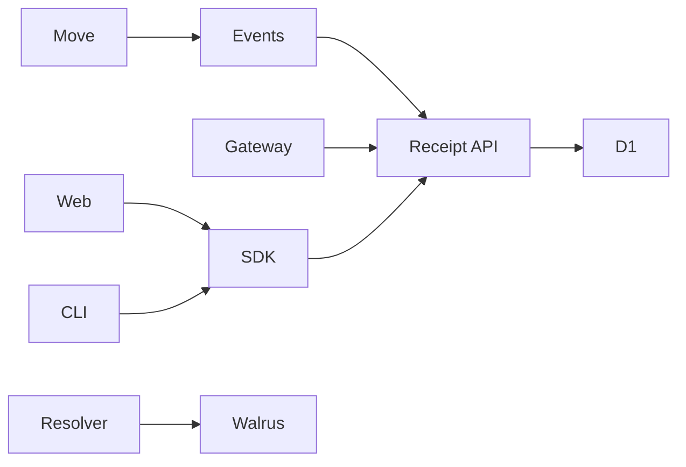

# OpenRails Component Inventory

Last updated: 2026-06-20

This document is an agent handoff map of the components that currently make up OpenRails. It is intended to help a new agent quickly find source-of-truth files, understand trust boundaries, run validation, and avoid unsafe staging or secret handling.

## Repository map

| Path | Role |
| --- | --- |
| `move/` | Sui Move protocol package and tests. |
| `sdk/` | TypeScript SDK, PTB builders, signatures, gateway, receipt parsing, proof client, CLI. |
| `services/receipt-api/` | Cloudflare Worker for receipts, streams, proofs, gateway collection, D1 storage, scheduled indexing. |
| `services/resolver/` | Cloudflare Worker for resolving Walrus OpenRails envelopes. |
| `apps/web/` | Read-only Vite React dashboard and landing page. |
| `examples/` | RailsCard, RailsFlow, gateway demo scripts. |
| `scripts/` | Testnet proof manifest and E2E guide. |
| `docs/` | Handoff and V1.2/V2 architecture blueprints. |
| `uiland/` | Untracked UI research/assets. Do not stage without explicit user approval. |

## System shape



## Trust boundaries

| Surface | Authority level | Notes |
| --- | --- | --- |
| Move package | authoritative onchain state | Owns channel lifecycle, asset movement, terminal settlement receipts. |
| `SettlementReceipt` event | authoritative terminal accounting | Source for receipt indexing and proof terminal state. |
| Gateway events | signed offchain projection | Useful for UX/webhooks, not final settlement authority. |
| Receipt API | aggregation/indexing layer | Reads Sui events and D1 projections. |
| Web dashboard | client display layer | Read-only in V1.1; no wallet writes. |
| SDK CLI | developer read/proof tool | Read-only Worker API client in V1.1. |
| Resolver Worker | metadata/envelope fetch layer | Validates OpenRails envelope shape from Walrus aggregators. |

## Move protocol components

### `move/sources/paycard_v1.move`

Primary V1.1 channel primitive.

Key object:

- `Paycard<T>`
  - shared Sui object,
  - stores payer, recipient, allocation pool, initial allocation, max flow rate, timestamps, residual delta recipient, optional Walrus blob ID, status.

Important functions:

| Function | Purpose |
| --- | --- |
| `mint_and_fund_envelope` | Opens a shared Paycard channel from payer funding. |
| `new_paycard` | Internal/shared construction helper used by vault unseal. |
| `calculate_accrual_debt` | Computes capped lazy accrual without unsafe multiplication overflow. |
| `execute_claim_round` | Recipient claim path for partial accrual. |
| `claim_settlement_round` | Recipient claim path that can deplete the channel and emit terminal receipt. |
| `resolve_residual_delta_expiry` | Expiry resolution path that pays accrued amount and routes residual through STN-Delta. |
| `cancel_paycard` | Payer cancellation path that pays accrued amount and routes residual through STN-Delta. |

Key status semantics:

- active,
- depleted,
- cancelled,
- expired by terminal receipt semantics.

Authoritative emissions:

- `PaycardMinted`,
- `SettlementClaimed`,
- `ResidualDeltaReturned`,
- `PaycardCancelled`,
- `SettlementReceipt`,
- `BlobIdAnchored`.

### `move/sources/sealed_vault.move`

RailsCard sealed vault primitive.

Key object:

- `SealedVault<T>`
  - funded signed escrow object,
  - stores payer auth, recipient terms, allocation, rate, duration, recovery target, nonce, curve, optional Walrus metadata.

Important functions:

| Function | Purpose |
| --- | --- |
| `create_sealed_vault` | Creates funded sealed vault. |
| `unseal_and_mint` | Verifies payer signature and opens a shared Paycard channel. |
| `cancel_vault` | Lets payer cancel sealed vault before unseal. |
| `build_vault_message` | Constructs signed message bytes for vault authorization. |
| view helpers | Read vault fields and status. |

Current replay model:

- vault signature includes a per-vault nonce,
- same vault cannot be unsealed twice due to status,
- no per-payer Nonce Lane registry exists yet.

### `move/sources/events.move`

Event and receipt module.

Important event structs:

| Event | Purpose |
| --- | --- |
| `PaycardMinted` | Channel opened with terms. |
| `SettlementClaimed` | Recipient claim event. |
| `ResidualDeltaReturned` | Residual routed to recovery target. |
| `PaycardCancelled` | Payer cancellation event. |
| `BlobIdAnchored` | Walrus/blob metadata anchor. |
| `SettlementReceipt` | Authoritative terminal accounting event. |
| `VaultSealed` | RailsCard vault created. |
| `VaultUnsealed` | RailsCard vault unsealed into channel. |
| `VaultCancelled` | RailsCard vault cancelled. |

## SDK components

### Public package surface

`sdk/package.json` defines:

- root export `@openrails/sdk`,
- `@openrails/sdk/browser`,
- `@openrails/sdk/worker`,
- `@openrails/sdk/api`,
- CLI bin `openrails`,
- package publish allowlist `dist/`.

### Module inventory

| File | Responsibility |
| --- | --- |
| `sdk/src/types.ts` | Core public types: intents, envelopes, RailsFlow payloads, vault params, settlement receipt types, settlement constants. |
| `sdk/src/sdk.ts` | Payload serialization/deserialization helpers. |
| `sdk/src/canonical.ts` | Canonical JSON and domain-separated bytes for signatures. |
| `sdk/src/signer.ts` | Permission envelope signing and verification, merchant-bound RailsFlow signature helpers. |
| `sdk/src/vault.ts` | RailsCard vault message building and signing helpers. |
| `sdk/src/link-encryption.ts` | AES-GCM encrypted short-link helpers. |
| `sdk/src/walrus.ts` | Walrus upload/fetch helpers and BlobID conversions. |
| `sdk/src/ptb.ts` | Programmable transaction builders for mint, claim, swap, resolve, vault create/unseal/cancel, channel cancel. |
| `sdk/src/network.ts` | Sui RPC endpoints, DeepBook IDs, coin types, Walrus endpoints. |
| `sdk/src/sponsor.ts` | Sponsored transaction helper. |
| `sdk/src/accrual.ts` | TypeScript mirror of Move accrual/projection math. |
| `sdk/src/heartbeat.ts` | Signed gateway heartbeat, buffer-low, terminal event builders and verifiers. |
| `sdk/src/gateway-store.ts` | In-memory and file-backed gateway state persistence. |
| `sdk/src/gateway.ts` | Stream Gateway polling loop, event projection, webhook delivery, retry/idempotency. |
| `sdk/src/receipts.ts` | Sui `SettlementReceipt` event parsing, querying, filtering, lookup by paycard. |
| `sdk/src/proof.ts` | Public proof object builder, explorer links, trust boundary labels. |
| `sdk/src/api.ts` | Typed Worker API client. |
| `sdk/src/cli.ts` | `openrails` CLI for health, receipts, streams, proofs. |
| `sdk/src/browser.ts` | Browser-safe export boundary. |
| `sdk/src/worker.ts` | Worker-safe export boundary. |
| `sdk/src/index.ts` | Main SDK export boundary. |

### SDK scripts

| Script | Purpose | Writes or submits? | Sensitive env names |
| --- | --- | --- | --- |
| `sdk/scripts/testnet-preflight.mjs` | Validates testnet config and required environment. | Read/check only unless expanded by caller. | private key env names are referenced, values must not be printed. |
| `sdk/scripts/tier1.mjs` | SDK smoke/behavior checks. | Local test only. | none expected. |
| `sdk/scripts/seed-testnet-showcase.mjs` | Seeds live testnet showcase channels and terminal receipts. | Submits Sui transactions. | `PAYER_PRIVATE_KEY`, `RECIPIENT_PRIVATE_KEY`, `MERCHANT_PRIVATE_KEY`. |
| `sdk/scripts/verify-testnet-showcase.mjs` | Verifies showcase manifest and chain state. | Read-only chain queries. | none expected. |
| `sdk/scripts/gateway-operator.mjs` | Runs Stream Gateway against active manifest paycards and Worker webhook. | Posts webhook events. | `GATEWAY_PRIVATE_KEY`. |
| `sdk/scripts/chmod-cli.mjs` | Sets `dist/cli.js` executable after build. | Local file mode change in `dist`. | none. |

## Receipt API Worker components

Directory: `services/receipt-api`.

| File | Responsibility |
| --- | --- |
| `src/handler.ts` | Cloudflare Worker router, CORS, config, auth, public routes, gateway event collector, proof route, scheduled handler. |
| `src/storage.ts` | D1 and in-memory storage implementations for receipts, gateway events, paycard states, indexer cursor. |
| `src/indexer.ts` | Cursor-based Sui `SettlementReceipt` event indexer. |
| `src/server.ts` | Local Node HTTP wrapper on port `8788`. |
| `migrations/0001_receipt_storage.sql` | D1 schema. |
| `test/handler.test.mjs` | Route, validation, gateway signature, idempotency, proof, indexer tests. |
| `wrangler.toml` | Cloudflare Worker name, vars, cron, D1 binding. |

Public routes:

- `GET /health`,
- `GET /v1/receipts`,
- `GET /v1/receipts/:paycardId`,
- `GET /v1/streams/:paycardId`,
- `GET /v1/streams/:paycardId/events`,
- `GET /v1/proofs/:paycardId`.

Operator routes:

- `POST /v1/gateway/events`,
- `POST /admin/index/receipts/run`.

Storage tables:

- `gateway_events`,
- `paycard_states`,
- `settlement_receipts`,
- `indexer_state`.

## Resolver Worker components

Directory: `services/resolver`.

| File | Responsibility |
| --- | --- |
| `src/handler.ts` | Fetches Walrus blobs, validates OpenRails plain or encrypted envelope shape, returns JSON. |
| `src/server.ts` | Local Node HTTP wrapper on port `8787`. |
| `wrangler.toml` | Cloudflare Worker name and entrypoint. |
| `package.json` | Build/dev/deploy scripts. |

Route:

```text
GET /v1/:blobId?network=testnet|mainnet
```

Walrus upstreams:

- testnet: `https://aggregator.walrus-testnet.walrus.space`,
- mainnet: `https://aggregator.walrus.space`.

## Web app components

Directory: `apps/web`.

Current role: read-only V1.1 dashboard and landing page.

Operational facts:

- framework: Vite + React,
- typecheck: `npm --prefix apps/web run typecheck`,
- build: `npm --prefix apps/web run build`,
- output: `apps/web/dist`,
- API default: `https://openrails-receipt-api.microcosm.workers.dev`,
- API override: `VITE_OPENRAILS_API_BASE_URL`.

### Data and service layer

| File | Responsibility |
| --- | --- |
| `src/services/openrailsApi.ts` | Worker API client integration, V1.1 package ID, tracked paycards, dashboard aggregate fetch. |
| `src/hooks/useMockDashboard.ts` | Dashboard route/scenario state and Worker loading lifecycle. |
| `src/data/showcase.ts` | Maps Worker receipts, streams, proofs into dashboard metrics, cards, activity, details. |
| `src/data/mock.ts` | Static fallback/mock dashboard entities. |
| `src/types/dashboard.ts` | Dashboard view-model types. |

### Main UI components

| File | Responsibility |
| --- | --- |
| `src/App.tsx` | App shell entry. |
| `src/main.tsx` | React root bootstrap. |
| `src/components/LandingPage.tsx` | Public landing page. |
| `src/components/DashboardShell.tsx` | Main dashboard route renderer. |
| `src/components/FlowCard.tsx` | Flow summary card. |
| `src/components/MetricCard.tsx` | Metric card. |
| `src/components/ReceiptPanel.tsx` | Receipt list/panel. |
| `src/components/StatusPill.tsx` | Status badge. |
| `src/components/StreamTable.tsx` | Stream table. |

### Dashboard-specific components

| File | Responsibility |
| --- | --- |
| `ActivityFeed.tsx` | Recent dashboard activity. |
| `CreatePreview.tsx` | Read-only create-flow preview. |
| `DashboardSidebar.tsx` | Navigation. |
| `DashboardTopbar.tsx` | Top bar and context. |
| `LifecycleTimeline.tsx` | Channel lifecycle visualization. |
| `PreviewModal.tsx` | Preview modal. |
| `ProofCenter.tsx` | Proof records and trust boundary display. |
| `RailProofModule.tsx` | Proof module summary. |
| `SettingsSurface.tsx` | Settings/info surface. |
| `StateBlock.tsx` | State summary block. |
| `StatusMatrix.tsx` | Operational status matrix. |
| `StreamDetail.tsx` | Detailed stream view. |
| `SurfaceHeader.tsx` | Shared section header. |
| `TrustBoundaryBanner.tsx` | Trust boundary explanation. |

### Styling/assets

| File | Responsibility |
| --- | --- |
| `src/styles.css` | Base app styles. |
| `src/redesign.css` | Dashboard/landing redesign styles. |
| `public/landingbg.jpg` | Landing background asset. |

## Proof and showcase artifacts

| File | Responsibility |
| --- | --- |
| `scripts/openrails-v1-1-showcase.manifest.json` | Public testnet proof manifest with package, paycards, receipts, and transaction links. |
| `scripts/test-e2e.md` | Manual E2E guide. Contains placeholder private key env names only. |

Known V1.1 package ID used by Worker/web/showcase:

```text
0x7cb4ca17166b7999223d665db2e43991288b1fd8466b930e4c2a345e847aaf55
```

Known active showcase paycards in web config:

```text
RailsCard: 0x1809f38156fb5f2724708523ebcce13f04c8bda613c9e9b87ed8ace9b632e627
RailsFlow: 0x698ccb11cf64a75f6d09e21cb09275a0d5631fe72992c62f23875f0e0eca5f2a
```

## Read paths vs write paths

### Public read/proof paths

- SDK API client,
- CLI health/receipt/stream/proof commands,
- receipt API public GET routes,
- web dashboard,
- resolver Worker.

### Operator/admin write paths

- gateway event collector,
- admin receipt index trigger,
- gateway operator script,
- testnet seeder script,
- Move transactions produced by SDK PTB builders.

### Not public in V1.1

- wallet connection,
- public write dashboard,
- public CLI transaction submission,
- access credential issuance,
- product receipt creation/export.

## Validation by component

| Component | Commands |
| --- | --- |
| Move | `sui move test --path move` |
| SDK | `npm --prefix sdk test` |
| Receipt API | `npm --prefix services/receipt-api test` |
| Resolver | `npm --prefix services/resolver run build` |
| Web | `npm --prefix apps/web run typecheck` and `npm --prefix apps/web run build` |
| Release hygiene | `git diff --check` |
| SDK package | `npm pack sdk --dry-run --json` from repo root or equivalent path form |

## Do-not-commit and secret safety

Do not commit:

```text
uiland/**
node_modules/**
dist/**
move/build/**
*:Zone.Identifier
scripts/openrails-v1-1-gateway-state.json
```

Never include secret values:

- private keys,
- seed phrases,
- local key exports,
- admin tokens,
- gateway private keys,
- bearer tokens,
- API secrets,
- raw Cloudflare secrets.

Environment variable names may be documented, but values must stay out of git and handoff notes.

## Known architectural gaps

- No Nonce Lane or `NonceEngine` implementation yet.
- No canonical `metadataHash` product receipt layer yet.
- No public write UI or wallet flow yet.
- No finalized access credential primitive yet.
- V2 Vault, Conduit, and DOF remain architecture blueprint only.
- Actual web hosting project, custom domain, and Cloudflare account state are not recorded in repo.
