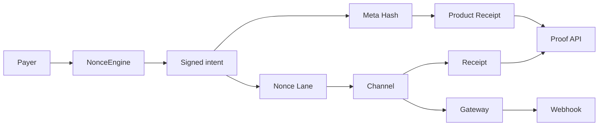
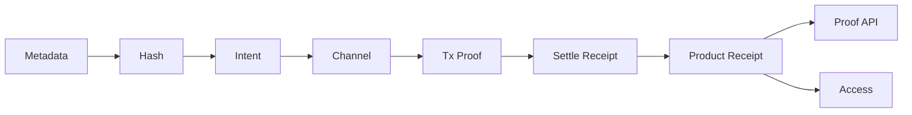

# OpenRails V1.2 Blueprint

## Purpose

V1.2 should make OpenRails safe for public write flows. The main architectural gaps after V1.1 are replay-safe concurrent signed intent handling and a formal product receipt layer. V1.2 introduces Nonce Lanes, an SDK `NonceEngine`, canonical metadata hashing, product receipts, public write UX foundations, and an access credential primitive while preserving V1.1 receipt and proof compatibility.

## V1.1 baseline

V1.1 already has:

- shared Paycard channels,
- recipient claim,
- payer cancellation,
- expiry resolution,
- STN-Delta receipt fields,
- gateway projections,
- durable receipt indexing,
- public proof API,
- SDK API client,
- read-only CLI,
- read-only web dashboard.

V1.1 does not have:

- onchain per-payer nonce lanes,
- SDK lane allocation,
- canonical `metadataHash`,
- product receipt schemas,
- public wallet write UI,
- finalized service access credentials.

## Target architecture



## Nonce Lane model

### Terms

| Term | Meaning |
| --- | --- |
| `nonceChannel` | Lane identifier selected by payer or SDK. |
| `nonceValue` | Expected next sequence value inside that lane. |
| Nonce Lane | Replay/concurrency path for one payer workflow. |
| `accountNonceTracks` | Authoritative onchain next nonce state. |
| `NonceEngine` | SDK helper that selects lanes and nonce values. |

### Desired invariant

For each payer and lane:

```text
storedNextNonce == signedNonceValue
```

If true, the protocol accepts the signed intent and increments the lane:

```text
storedNextNonce = signedNonceValue + 1
```

The same signed intent cannot be replayed.

## Sui object model options

### Option A, shared nonce registry

Create a shared registry object:

```move
public struct NonceRegistry has key {
    id: UID,
    lanes: Table<address, Table<u64, u64>>,
}
```

Pros:

- closest to `accountNonceTracks[payer][nonceChannel]`,
- single source of truth,
- simple SDK reads.

Cons:

- shared-object contention,
- every write intent touches the registry,
- may limit throughput for busy payers or lanes.

### Option B, per-payer nonce account

Create one shared or owned nonce account per payer:

```move
public struct NonceAccount has key {
    id: UID,
    payer: address,
    lanes: Table<u64, u64>,
}
```

Pros:

- isolates payer contention,
- clearer ownership and lifecycle,
- easier to migrate per payer.

Cons:

- requires account discovery or explicit object passing,
- first-use setup flow is needed.

### Option C, lane objects

Represent each lane as its own object:

```move
public struct NonceLane has key {
    id: UID,
    payer: address,
    nonce_channel: u64,
    next_nonce_value: u64,
}
```

Pros:

- best parallelism across lanes,
- object identity can be explicit in PTBs,
- easy to delegate workflow-specific lanes.

Cons:

- more objects to manage,
- SDK must help users create/find lanes,
- lane object loss or confusion can hurt UX.

## Recommended V1.2 direction

Use **per-payer nonce account** first unless throughput testing proves lane-object parallelism is required.

Rationale:

- clear payer ownership,
- fewer objects than one object per lane,
- avoids a global registry bottleneck,
- maps cleanly to SDK `NonceEngine`.

## Signed intent changes

Add these fields to public write intent signing:

```text
nonceChannel: u64
nonceValue: u64
metadataHash: bytes
```

Rules:

- both fields must be signature-covered,
- `metadataHash` must be signature-covered for product-bound public writes,
- neither field can be rewritten by relayers or merchants,
- protocol consumes the nonce before or atomically with channel creation,
- failed validation must not increment a nonce,
- successful channel open must increment exactly once.

## Affected write paths

V1.2 should protect at least:

- RailsFlow mint/open,
- RailsCard unseal/open,
- sponsored or delegated open flows,
- future access credential issuance if it spends or authorizes value.

Claim, cancel, and resolve are currently sender/object/status guarded. They do not require signed-intent nonces unless V1.2 adds delegated claim/cancel/resolve.

## SDK NonceEngine

`NonceEngine` responsibilities:

- choose default lanes,
- request current lane nonce from chain or API,
- reserve nonce values locally before signing,
- recover from stale nonce errors,
- expose explicit lane selection for advanced users.

Example API shape:

```ts
const engine = createNonceEngine({ client, packageId, payer });

const nonce = await engine.next({
  nonceChannel: 1n,
  purpose: "api-usage",
});

const intent = await signOpenIntent({
  ...terms,
  nonceChannel: nonce.channel,
  nonceValue: nonce.value,
});
```

Local reservation is a UX optimization only. Onchain nonce state remains authoritative.

## Receipt Layer

V1.2 should formalize a product receipt layer above the existing V1.1 onchain `SettlementReceipt`.



### Receipt taxonomy

| Receipt artifact | Exists in V1.1 | Authority | Purpose |
| --- | --- | --- | --- |
| Transaction evidence | Partial | Sui transaction and event evidence | Proves a transaction and event were included onchain. |
| `SettlementReceipt` | Yes | Authoritative onchain terminal accounting event | Proves terminal payout, expiry, cancellation, and residual delta accounting. |
| Gateway projection receipt | Partial | Gateway-signed, non-authoritative | Reports live stream projection or terminal observation to webhooks and APIs. |
| Product receipt | No | Derived from chain evidence plus metadata | Business-readable proof for merchants, services, and users. |
| Residual recovery receipt | Partial | Derived from terminal receipt residual fields | Business-readable proof that unused capital was recovered. |
| Proof receipt | Partial | Aggregated proof API response | Joins onchain receipt, projection, explorer links, and trust boundaries. |

Current V1.1 public APIs mostly use "receipt" to mean the terminal `SettlementReceipt`. V1.2 should keep that meaning intact while adding product-layer receipt schemas that can be reconstructed from onchain evidence and canonical metadata.

### Authority levels

| Artifact | What it proves | Authority |
| --- | --- | --- |
| Product metadata | Business terms | Offchain, hash-bound. |
| `metadataHash` | Exact metadata commitment | Signature-covered, optionally anchored by Walrus. |
| Signed intent | Payer authorized channel terms | Cryptographic signature plus nonce lane validation. |
| Transaction evidence | Transaction executed on Sui | Chain evidence. |
| Channel state | Current stream status | Authoritative onchain state. |
| `SettlementReceipt` | Terminal accounting | Authoritative onchain event. |
| Product receipt | Business-readable outcome | Derived from chain evidence plus metadata. |
| Gateway projection | Live operational update | Gateway-signed, non-authoritative. |

## Canonical metadata hash

V1.2 should introduce a required `metadataHash` for product-bound public writes.

Current V1.1 state:

- RailsFlow can sign `invoiceDescription`.
- RailsCard can anchor Walrus metadata through `walrusBlobId`.
- There is no canonical invoice schema or universal `metadataHash` field yet.

V1.2 target:

```text
canonical metadata bytes -> metadataHash -> signed intent -> channel -> receipt/proof
```

Rules:

- metadata canonicalization must be deterministic,
- the hash algorithm must be fixed and versioned,
- `metadataHash` must be included in public write signed intents,
- optional `walrusBlobId` can point to encrypted or public metadata bytes,
- product receipts must include the same `metadataHash`,
- changing invoice or product terms after signing must produce a different hash.

Candidate metadata fields:

- invoice ID,
- merchant or service ID,
- payer reference,
- product or service description,
- requested amount,
- token or currency,
- service terms,
- expiration,
- usage policy,
- order reference,
- optional Walrus blob ID.

## Product receipt schema

V1.2 should add a product receipt JSON schema in the SDK before adding PDF, QR, or merchant exports.

Draft shape:

```json
{
  "schemaVersion": "1.0",
  "receiptType": "payment | settlement | residual_recovery",
  "receiptId": "openrails_receipt_...",
  "paycardId": "0x...",
  "payer": "0x...",
  "recipient": "0x...",
  "merchant": "merchant-id-or-address",
  "productId": "sku-or-service-id",
  "metadataHash": "0x...",
  "walrusBlobId": "optional",
  "issuedAt": "2026-06-20T00:00:00.000Z",
  "expiresAt": "optional",
  "settlementBinding": {
    "transactionDigest": "...",
    "eventSeq": "...",
    "settlementType": 0,
    "totalPaidToRecipient": "0",
    "residualDeltaAmount": "0"
  },
  "proofRef": "https://...",
  "signature": "optional"
}
```

Product receipts should be SDK-generated first:

- `createPaymentReceipt(...)`,
- `createSettlementReceipt(...)`,
- `createResidualRecoveryReceipt(...)`.

They can later support:

- receipt QR codes,
- PDF export,
- merchant dashboard receipt views,
- receipt webhook events,
- gateway-signed receipt snapshots.

The Move package should not store product receipt text. It only needs enough canonical state for receipts to be reconstructed and verified.

## Public write UX requirements

Before exposing writes in the web app:

- wallet disconnected,
- wrong network,
- insufficient balance,
- pending signature,
- transaction submitted,
- waiting for finality,
- confirmed,
- failed,
- stale nonce,
- rejected signature,
- expired terms,
- cancellation preview,
- irreversible settlement warning.

Write actions should be explicit:

- open channel,
- claim accrued value,
- cancel active channel,
- resolve expired channel.

No write action should be hidden behind decorative UI.

## Access credential primitive

V1.2 should define a service access credential that binds:

- `paycardId`,
- payer or recipient address,
- service or merchant identifier,
- product receipt ID,
- `metadataHash`,
- expiry,
- signature or proof reference.

Candidate headers:

```http
Authorization: OpenRails <credential>
X-OpenRails-Paycard-Id: 0x...
X-OpenRails-Metadata-Hash: 0x...
```

Verification path:

1. Service receives credential.
2. Service verifies credential signature or proof.
3. Service queries proof/read API or chain state.
4. Service checks active balance, expiry, or terminal receipt.
5. Service grants or denies access.

## Worker and indexer impacts

Potential new routes:

```text
GET /v1/nonces/:payer
GET /v1/nonces/:payer/:nonceChannel
GET /v1/product-receipts/:receiptId
GET /v1/paycards/:paycardId/product-receipts
GET /v1/access/:paycardId
```

Write routes should remain avoided unless the Worker becomes a relayer. If relaying is introduced, it requires explicit auth, rate limits, replay handling, and abuse controls.

## Validation criteria

Move:

- nonce account creation,
- lane initialization,
- correct nonce consumption,
- stale nonce rejection,
- cross-lane concurrency,
- replay rejection,
- failed intent does not increment,
- channel open increments exactly once.

SDK:

- `NonceEngine` lane selection,
- stale nonce recovery,
- explicit lane override,
- concurrent signing tests,
- API and CLI support.

Backend:

- nonce read routes,
- projection/indexer compatibility,
- proof object includes nonce lane metadata if relevant,
- product receipt reads return only verified metadata commitments and chain bindings,
- product receipt records link to existing `SettlementReceipt` evidence.

Frontend:

- wallet/write states,
- stale nonce messaging,
- metadata hash mismatch messaging,
- product receipt display,
- transaction lifecycle display,
- read-only proof boundaries remain clear.

## Risks

- Shared-object contention if nonce state is centralized.
- Poor lane UX can produce stale or fragmented nonce state.
- Adding nonce fields changes signed intent compatibility.
- Adding `metadataHash` changes signed intent compatibility for product-bound writes.
- Product receipt signatures can confuse authority boundaries if not clearly labeled.
- Any public relayer path creates abuse and spam risk.
- Sponsored transactions need strict binding of payer, nonce, channel terms, and sponsor intent.

## Open decisions

1. Nonce storage model: per-payer account vs lane object.
2. Whether nonce lanes are mandatory for all opens or only signed/delegated opens.
3. Whether public writes are wallet-direct only or include a relayer.
4. Whether access credentials are signed by payer, gateway, merchant, or a dedicated OpenRails issuer.
5. Hash algorithm and canonical metadata schema.
6. Whether product receipts are merchant-signed, gateway-signed, payer-signed, or unsigned derived artifacts.
7. Where product receipt records live, SDK-only, Worker-indexed, merchant-hosted, or all three.
8. Whether V1.2 should be a new package publish or a compatibility layer over V1.1.
