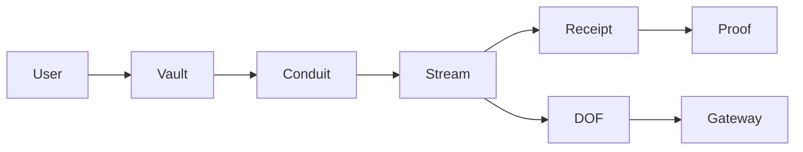

# OpenRails V2 Blueprint

## Purpose

V2 is the longer-term architecture for OpenRails as a programmable settlement network. It should evolve beyond direct Paycard channels into a Vault, Conduit, and DOF model while preserving the V1.1 and V1.2 proof story.

## V2 goals

- Separate user funds, authorization, routing, and settlement into explicit primitives.
- Support many concurrent payment workflows without replay risk.
- Make access, billing, settlement, and receipt graphs first-class.
- Preserve auditable terminal receipts.
- Keep offchain gateways non-authoritative.
- Support migration from V1.1/V1.2 without breaking existing proof consumers.

## Conceptual model



## Core primitives

### User Vault

The User Vault is the payer-controlled capital and authorization boundary.

Responsibilities:

- hold or reference escrowable capital,
- enforce payer authorization,
- enforce nonce lanes,
- create or fund Conduits,
- provide recovery and policy hooks.

Non-goals:

- it should not become an offchain account database,
- it should not trust gateway projections for settlement,
- it should not hide irreversible state changes from users.

### Conduit

A Conduit is a workflow-specific payment rail attached to a Vault.

Examples:

```text
Conduit 0 -> invoice payments
Conduit 1 -> API usage payments
Conduit 2 -> creator payouts
```

Responsibilities:

- isolate payment workflow terms,
- hold or route allocated capital,
- create streams,
- bind metadata and access credentials,
- manage lifecycle policy for that workflow.

Conduits can map naturally to Nonce Lanes, but they are not identical:

| Concept | Purpose |
| --- | --- |
| Nonce Lane | Replay and concurrency sequence. |
| Conduit | Workflow, capital, and policy boundary. |

### DOF — locked: Dynamic Object Fields (Sui-native)

**Decision (locked): `DOF` = Sui Dynamic Object Fields.** It is not a new contract field name; it is the storage/composition mechanism that wires the graph together. A `Vault` attaches its `Conduit`s as dynamic object fields keyed by `nonce_channel`; a `Conduit` attaches its `Stream`s (today's `Paycard<T>`) as dynamic object fields keyed by `stream_seq`. This makes the receipt graph traversable by object ownership rather than by an offchain index, and lets a Vault hold an unbounded, type-heterogeneous set of Conduits/Streams without a giant monolithic struct.

What the DOF layer provides:

- composition: `Vault --dof[channel]--> Conduit --dof[seq]--> Stream`,
- enumeration: walk a Vault's conduits and a Conduit's streams on-chain for proof-graph assembly,
- isolation: each Stream remains an independent settlement object emitting its own `SettlementReceipt`,
- migration safety: V1.1 standalone `Paycard<T>` objects stay valid; V2 simply nests the same primitive under a Conduit.

Lifecycle hooks, routing, and access policy live on the `Conduit` (see ABI sketch), not in the DOF mechanism itself.

### Stream

The Stream remains the settlement primitive closest to V1.1 Paycard channels.

Responsibilities:

- track recipient, payer, rate, duration, allocation, status,
- emit terminal receipts,
- support claim, cancel, and resolve semantics,
- remain auditable independently of UI or gateway state.

## Locked object model (ABI sketch)

Spec only — not yet built. Builds on the **shipped V1.2** `nonce_account` module
(`NonceAccount { payer, lanes: Table<channel, nextValue> }`) and the existing
`Paycard<T>` (renamed conceptually to `Stream<T>`, struct unchanged + the V1.2
`metadata_hash` field).

```move
/// Payer-controlled capital + authorization boundary. Shared.
public struct Vault has key {
    id: UID,
    owner: address,
    nonce_account: ID,        // references the payer's V1.2 NonceAccount
    // Conduits attached as dynamic object fields keyed by nonce_channel:
    //   dof::add(&mut vault.id, channel, conduit)
}

/// Workflow-specific rail under a Vault. One Conduit per nonce lane (channel).
public struct Conduit has key, store {
    id: UID,
    vault: ID,
    nonce_channel: u64,       // the lane this conduit's opens consume
    policy: ConduitPolicy,    // immutable-after-create or versioned
    next_stream_seq: u64,
    // Streams (Paycard<T>) attached as dynamic object fields keyed by stream_seq.
}

public struct ConduitPolicy has store, copy, drop {
    asset_type: TypeName,
    max_alloc_per_stream: u64,
    default_recovery_target: address,
    metadata_hash_required: bool,
}
```

Entry sketch (names indicative; `verify_and_consume` is the shipped V1.2 call):

```move
public entry fun create_vault(ctx)                              // shares a Vault, binds caller's NonceAccount
public entry fun open_conduit(vault, nonce_channel, policy, ctx)
public entry fun open_stream_in_conduit<T>(                     // RailsFlow under a conduit
    vault, conduit, nonce_account, nonce_value, metadata_hash,
    funding, alloc, rate, recipient, start, duration, recovery, ctx)
public entry fun unseal_stream_in_conduit<T>(...)              // RailsCard under a conduit
// claim/cancel/resolve reuse today's Paycard entries unchanged
```

Each open calls `nonce_account::verify_and_consume(nonce_account, owner, conduit.nonce_channel, nonce_value)` exactly as the V1.2 `create_sealed_vault` / `mint_and_fund_envelope` do today, then attaches the new `Stream` as a DOF under the `Conduit`. **Conduit ↔ nonce lane is 1:1**; the Vault holds the `NonceAccount` reference so all lanes share one authoritative counter object.

## Trust boundaries

| Boundary | Authority | Notes |
| --- | --- | --- |
| Vault | onchain | Owns payer authorization and funds policy. |
| Conduit | onchain | Owns workflow-specific channel policy. |
| Stream | onchain | Owns active settlement state. |
| Receipt | onchain event/indexed proof | Authoritative terminal accounting. |
| Gateway | offchain | Non-authoritative projection and webhook layer. |
| Proof API | offchain + onchain evidence | Aggregates receipts, projections, and explorer links. |
| Dashboard | client | Read/write UX, never settlement authority. |

## V1.1 to V2 migration path

### Phase 1, preserve V1.1 proofs

- Keep V1.1 package IDs and receipt event parsing.
- Keep `SettlementReceipt` fields compatible in SDK and API.
- Keep proof endpoint able to answer for V1.1 paycards.

### Phase 2, introduce V1.2 nonce lanes

- Add replay-safe signed intent architecture.
- Add SDK `NonceEngine`.
- Add public write UX only after nonce handling is safe.

### Phase 3, publish V2 primitives

- Add Vault.
- Add Conduit.
- Add DOF model.
- Add migration-aware proof schema.

### Phase 4, route new product flows through V2

- New public writes use Vault and Conduit.
- V1.1 channels remain readable and provable.
- Gateway can project both V1.1 and V2 streams.

## Receipt graph compatibility

V2 should treat receipts as graph nodes:

```text
Vault -> Conduit -> Stream -> SettlementReceipt
```

Each terminal receipt should be linkable to:

- package ID,
- vault ID,
- conduit ID,
- stream/paycard ID,
- payer,
- recipient,
- settlement type,
- total paid,
- residual delta,
- transaction digest,
- event sequence.

The proof API can then expose:

```text
GET /v1/proofs/:streamId
GET /v2/proofs/:vaultId
GET /v2/proofs/:conduitId
```

V2 proof objects should preserve the V1.1 trust boundary language:

- onchain state is authoritative,
- gateway projections are UX hints,
- terminal receipts are accounting proofs.

## Gateway and webhook model

The Stream Gateway remains offchain.

Responsibilities:

- watch onchain stream and receipt activity,
- build local projection state,
- sign outgoing events,
- deliver idempotent webhooks,
- retry failed deliveries,
- report lag and cursor state.

It must not:

- decide settlement,
- bypass nonce checks,
- mint or close streams without payer authorization,
- grant access without verifiable backing state.

## Access model

V2 should make access credentials explicit.

Credential should bind:

- Vault or Conduit,
- stream/paycard ID,
- service or merchant,
- user or payer,
- metadata hash,
- expiry,
- permitted action,
- proof reference.

Services should verify credentials against:

- signature,
- active stream state,
- receipt state,
- expiry,
- service binding.

## API boundaries

Read APIs:

```text
GET /v2/vaults/:vaultId
GET /v2/conduits/:conduitId
GET /v2/streams/:streamId
GET /v2/proofs/:id
GET /v2/nonces/:payer/:lane
```

Operator APIs:

```text
POST /v2/gateway/events
POST /v2/admin/index
POST /v2/admin/backfill
```

Public write APIs should be avoided unless OpenRails deliberately becomes a relayer. Wallet-direct writes are safer for the first public product surface.

## Security requirements

- Per-payer nonce lanes are mandatory for signed/delegated opens.
- All intent fields that affect funds or access must be signature-covered.
- Conduit policy must be immutable or versioned after stream creation.
- Gateway events must be signed and idempotent.
- Admin routes must require secrets and should be rate limited.
- Public reads must not leak private metadata.
- Public writes must surface irreversible transaction risk.
- Receipt indexing must be cursor-safe and idempotent.

## Rollout and rollback

Rollout:

1. ship V1.2 nonce/write foundations,
2. publish V2 package to testnet,
3. seed V2 proof flows,
4. extend gateway and proof API to parse V2,
5. expose V2 dashboard read path,
6. expose wallet-direct V2 writes.

Rollback:

- code rollback is straightforward before package publish,
- after package publish, onchain packages and emitted events are immutable,
- APIs can fall back to V1.1/V1.2 proof readers,
- frontend can hide V2 write flows behind feature flags,
- indexer migrations should preserve existing receipt tables.

## Locked decisions (V2 spec)

1. **DOF = Sui Dynamic Object Fields** (storage mechanism, not a contract field). Vault→Conduit→Stream are composed via DOFs.
2. **Conduit is a dynamic object field under Vault** (has `key, store`), keyed by `nonce_channel`. Not a separate top-level shared object.
3. **Vault does not custody funds directly.** Funds live in the per-Stream allocation pool (today's `Paycard.allocation_pool`); the Vault owns references/composition only. This preserves the V1.1 owned-pool isolation and parallelism story.
4. **Nonce lanes live in the standalone `NonceAccount`** (shipped in V1.2), referenced by the Vault — not embedded in Vault or Conduit. One counter object per payer; one lane per Conduit.
5. **Access credentials are payer-signed**, optionally co-signed by the merchant for RailsFlow (the existing `bindRailsFlowMerchant` pattern). Gateway never signs credentials. (Detail finalized in the Phase 4 access-credential spec.)
6. **First public write surface is wallet-direct only.** Relayed/sponsored execution is supported by the protocol (nonce lanes make it replay-safe) but is a later opt-in, not the default product surface.
7. **`Stream` is the public V2 primitive name**; `Paycard<T>` remains the implementation struct for migration continuity. Docs/SDK surface "stream", code keeps `Paycard` until a V2 package rename is justified.

## Status

Design locked (this document). **No V2 code is built yet** — build begins after V1.2 ships (SDK NonceEngine + public writes + product receipts), per the migration phases above. The V1.2 `nonce_account` module and `metadata_hash` binding it depends on are **implemented** (see `v1.2-blueprint.md`).
