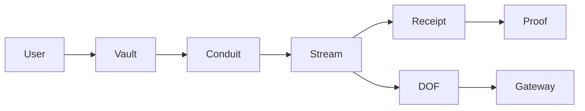

# OpenRails V2 Blueprint

## Purpose

V2 is the longer-term architecture for OpenRails as a programmable settlement network. It should evolve beyond direct Paycard channels into a Vault, Conduit, and DOF model while preserving the V1.1 and V1.2 proof story.

## V2 goals

- Separate user funds, authorization, routing, and settlement into explicit primitives.
- Support many concurrent payment workflows without replay risk.
- Make access, billing, settlement, and receipt graphs first-class.
- Preserve auditable terminal receipts.
- Keep offchain gateways non-authoritative.
- Support migration from V1.1/V1.2 without breaking existing proof consumers.

## Conceptual model



## Core primitives

### User Vault

The User Vault is the payer-controlled capital and authorization boundary.

Responsibilities:

- hold or reference escrowable capital,
- enforce payer authorization,
- enforce nonce lanes,
- create or fund Conduits,
- provide recovery and policy hooks.

Non-goals:

- it should not become an offchain account database,
- it should not trust gateway projections for settlement,
- it should not hide irreversible state changes from users.

### Conduit

A Conduit is a workflow-specific payment rail attached to a Vault.

Examples:

```text
Conduit 0 -> invoice payments
Conduit 1 -> API usage payments
Conduit 2 -> creator payouts
```

Responsibilities:

- isolate payment workflow terms,
- hold or route allocated capital,
- create streams,
- bind metadata and access credentials,
- manage lifecycle policy for that workflow.

Conduits can map naturally to Nonce Lanes, but they are not identical:

| Concept | Purpose |
| --- | --- |
| Nonce Lane | Replay and concurrency sequence. |
| Conduit | Workflow, capital, and policy boundary. |

### DOF

DOF is the programmable direction/order/flow layer. It describes how value and permissions move through Conduits.

Candidate responsibilities:

- route funds across stream types,
- define lifecycle hooks,
- attach metadata and access policy,
- support receipt graph generation,
- prepare for multi-service or multi-party settlement.

The exact acronym expansion should be locked before ABI naming. Until then, treat DOF as an architectural placeholder, not a committed contract field name.

### Stream

The Stream remains the settlement primitive closest to V1.1 Paycard channels.

Responsibilities:

- track recipient, payer, rate, duration, allocation, status,
- emit terminal receipts,
- support claim, cancel, and resolve semantics,
- remain auditable independently of UI or gateway state.

## Trust boundaries

| Boundary | Authority | Notes |
| --- | --- | --- |
| Vault | onchain | Owns payer authorization and funds policy. |
| Conduit | onchain | Owns workflow-specific channel policy. |
| Stream | onchain | Owns active settlement state. |
| Receipt | onchain event/indexed proof | Authoritative terminal accounting. |
| Gateway | offchain | Non-authoritative projection and webhook layer. |
| Proof API | offchain + onchain evidence | Aggregates receipts, projections, and explorer links. |
| Dashboard | client | Read/write UX, never settlement authority. |

## V1.1 to V2 migration path

### Phase 1, preserve V1.1 proofs

- Keep V1.1 package IDs and receipt event parsing.
- Keep `SettlementReceipt` fields compatible in SDK and API.
- Keep proof endpoint able to answer for V1.1 paycards.

### Phase 2, introduce V1.2 nonce lanes

- Add replay-safe signed intent architecture.
- Add SDK `NonceEngine`.
- Add public write UX only after nonce handling is safe.

### Phase 3, publish V2 primitives

- Add Vault.
- Add Conduit.
- Add DOF model.
- Add migration-aware proof schema.

### Phase 4, route new product flows through V2

- New public writes use Vault and Conduit.
- V1.1 channels remain readable and provable.
- Gateway can project both V1.1 and V2 streams.

## Receipt graph compatibility

V2 should treat receipts as graph nodes:

```text
Vault -> Conduit -> Stream -> SettlementReceipt
```

Each terminal receipt should be linkable to:

- package ID,
- vault ID,
- conduit ID,
- stream/paycard ID,
- payer,
- recipient,
- settlement type,
- total paid,
- residual delta,
- transaction digest,
- event sequence.

The proof API can then expose:

```text
GET /v1/proofs/:streamId
GET /v2/proofs/:vaultId
GET /v2/proofs/:conduitId
```

V2 proof objects should preserve the V1.1 trust boundary language:

- onchain state is authoritative,
- gateway projections are UX hints,
- terminal receipts are accounting proofs.

## Gateway and webhook model

The Stream Gateway remains offchain.

Responsibilities:

- watch onchain stream and receipt activity,
- build local projection state,
- sign outgoing events,
- deliver idempotent webhooks,
- retry failed deliveries,
- report lag and cursor state.

It must not:

- decide settlement,
- bypass nonce checks,
- mint or close streams without payer authorization,
- grant access without verifiable backing state.

## Access model

V2 should make access credentials explicit.

Credential should bind:

- Vault or Conduit,
- stream/paycard ID,
- service or merchant,
- user or payer,
- metadata hash,
- expiry,
- permitted action,
- proof reference.

Services should verify credentials against:

- signature,
- active stream state,
- receipt state,
- expiry,
- service binding.

## API boundaries

Read APIs:

```text
GET /v2/vaults/:vaultId
GET /v2/conduits/:conduitId
GET /v2/streams/:streamId
GET /v2/proofs/:id
GET /v2/nonces/:payer/:lane
```

Operator APIs:

```text
POST /v2/gateway/events
POST /v2/admin/index
POST /v2/admin/backfill
```

Public write APIs should be avoided unless OpenRails deliberately becomes a relayer. Wallet-direct writes are safer for the first public product surface.

## Security requirements

- Per-payer nonce lanes are mandatory for signed/delegated opens.
- All intent fields that affect funds or access must be signature-covered.
- Conduit policy must be immutable or versioned after stream creation.
- Gateway events must be signed and idempotent.
- Admin routes must require secrets and should be rate limited.
- Public reads must not leak private metadata.
- Public writes must surface irreversible transaction risk.
- Receipt indexing must be cursor-safe and idempotent.

## Rollout and rollback

Rollout:

1. ship V1.2 nonce/write foundations,
2. publish V2 package to testnet,
3. seed V2 proof flows,
4. extend gateway and proof API to parse V2,
5. expose V2 dashboard read path,
6. expose wallet-direct V2 writes.

Rollback:

- code rollback is straightforward before package publish,
- after package publish, onchain packages and emitted events are immutable,
- APIs can fall back to V1.1/V1.2 proof readers,
- frontend can hide V2 write flows behind feature flags,
- indexer migrations should preserve existing receipt tables.

## Open decisions

1. Exact DOF name and ABI terminology.
2. Whether Conduit is a shared object, owned object, or dynamic field under Vault.
3. Whether Vault holds funds directly or owns references to funded stream objects.
4. Whether nonce lanes live in Vault, Conduit, or separate NonceAccount objects.
5. Whether access credentials are payer-signed, gateway-signed, merchant-signed, or multi-signed.
6. Whether public write flows should be wallet-direct only or include relayed execution.
7. Whether V2 should keep `Paycard` naming or promote `Stream`/`Channel` as the public primitive.
